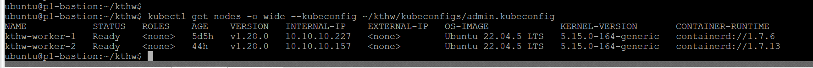
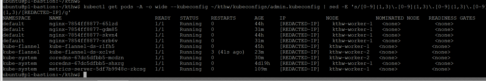
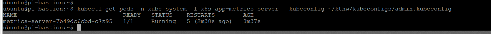
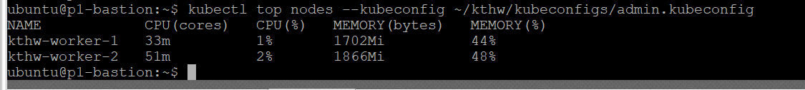
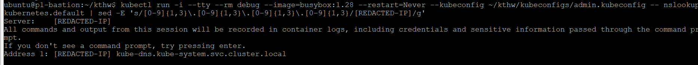
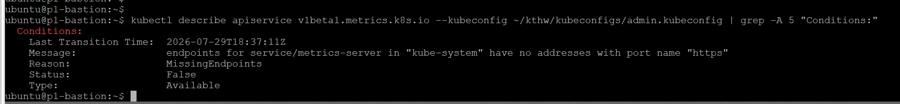

# ☸️ Kubernetes The Hard Way — OpenStack Bare-Metal

> Manual, installer-free Kubernetes cluster deployment on real OpenStack infrastructure — built from scratch to master every layer of the distributed stack.


---

## 🎯 Project Overview

This project follows Kelsey Hightower's **"Kubernetes The Hard Way"** methodology, adapted for a real **OpenStack bare-metal** environment with a **single control plane architecture** (`kthw-controller-1`). Every binary, certificate, systemd service, and routing table is manually configured — **no `kubeadm`, no helper scripts, no shortcuts**.

| Component / Layer | Deep-Dive Objective |
|---|---|
| **TLS Bootstrap & PKI** | Hand-generate a private CA (`cfssl`), construct custom CSR configs, and enforce mTLS across all control plane and worker components |
| **Distributed Consensus (`etcd`)** | Manually configure, bootstrap, and secure an `etcd` instance for cluster state persistence |
| **Control Plane Binaries** | Provision systemd-managed `kube-apiserver`, `kube-controller-manager`, and `kube-scheduler` with secure authorization flags |
| **Container Runtime (`containerd`)** | Install and tune `containerd` + `runc` with `SystemdCgroup` driver to prevent sandbox execution failures |
| **Overlay Networking (CNI)** | Establish Flannel VXLAN routing across bare-metal nodes, managing subnet leases and CNI config lifecycle |
| **Cluster Add-ons** | Bootstrap CoreDNS for internal service discovery and deploy Metrics Server for resource telemetry |

> This is not a tutorial clone — it documents a **live deployment on real OpenStack infrastructure** with granular root-cause analysis for networking failures, clock synchronization anomalies, and sandbox runtime blocks.

---

## 🏗️ Architecture & Topology

```
                    ┌──────────────────┐
                    │   p1-bastion     │
                    │  (admin access,  │
                    │  TLS gen, kubectl)│
                    └────────┬─────────┘
                             │
                    ┌────────▼──────────┐
                    │ kthw-controller-1 │
                    │                   │
                    │  • etcd           │
                    │  • kube-apiserver │
                    │  • kube-ctrl-mgr  │
                    │  • kube-scheduler │
                    └────────┬──────────┘
                             │
               ┌─────────────┴─────────────┐
               │                           │
      ┌────────▼────────┐       ┌──────────▼──────────┐
      │  kthw-worker-1  │       │   kthw-worker-2     │
      │                 │       │                     │
      │  • kubelet      │       │  • kubelet          │
      │  • kube-proxy   │       │  • kube-proxy       │
      │  • containerd   │       │  • containerd       │
      └─────────────────┘       └─────────────────────┘
```

### Component Stack

| Layer | Technology | Role |
|---|---|---|
| Cloud Infrastructure | OpenStack Bare-Metal — Ubuntu 22.04 LTS | Physical compute and L2/L3 network boundary |
| Bastion Host | `p1-bastion` | TLS generation, `kubectl` orchestration via `admin.kubeconfig` |
| Control Plane | `kthw-controller-1` | Hosts all orchestration loops and state persistence |
| Worker Nodes | `kthw-worker-1`, `kthw-worker-2` | Execute container workloads and network routing |
| Container Runtime | `containerd` 1.7.x + `runc` | OCI-compliant runtime managing container lifecycles |
| Networking CNI | Flannel (VXLAN backend) | Overlay network for cross-node pod-to-pod traffic |
| DNS | CoreDNS v1.10+ | Internal service discovery mapping DNS records to ClusterIPs |

---

## 📂 Repository Structure

```text
kthw/
├── 📁 configs/                         # Systemd unit files & component config templates
│   ├── containerd.toml                 # containerd runtime config (SystemdCgroup enforcement)
│   ├── kube-apiserver.service          # API server systemd unit
│   ├── kube-controller-manager.service # Controller manager systemd unit
│   ├── kube-proxy-config.yaml          # Kube-proxy node config spec
│   ├── kube-scheduler.yaml             # Kube-scheduler routing profile
│   ├── kubelet-config.yaml             # Worker kubelet runtime config
│   └── kubelet.service                 # Kubelet systemd unit
├── 📁 manifests/                       # Kubernetes YAML resource manifests
│   ├── coredns.yaml                    # CoreDNS deployment, ServiceAccount, ClusterIP service
│   ├── flannel.yaml                    # Flannel CNI DaemonSet + RBAC rules
│   └── metrics-server.yaml            # Metrics Server deployment spec
├── 📁 tls/                             # cfssl PKI configuration files
│   ├── ca-config.json                  # Root CA signing profile and validity windows
│   ├── ca-csr.json                     # Root Certificate Signing Request parameters
│   ├── etcd-csr.json                   # etcd peer and server TLS certificate config
│   └── kube-csr.json                   # Component CSRs (apiserver, kubelet, proxy, admin)
└── 📁 screenshots/                     # Live cluster verification captures
    ├── cluster-nodes.png
    ├── cluster-pods-all.png
    ├── dns-resolution-test.png
    ├── metrics-server-pod.png
    ├── metrics-top-nodes.png
    └── apiservice-available.png
```

---

## 🚀 Deployment Guide

### Step 1 — Infrastructure Provisioning

Provision four bare-metal VMs inside your OpenStack tenant running **Ubuntu 22.04 LTS**:

| Host | Role |
|---|---|
| `p1-bastion` | Admin jump-host — TLS generation, `kubectl`, kubeconfig distribution |
| `kthw-controller-1` | Single control plane — `etcd`, `kube-apiserver`, `kube-controller-manager`, `kube-scheduler` |
| `kthw-worker-1` | Worker node — `kubelet`, `kube-proxy`, `containerd` |
| `kthw-worker-2` | Worker node — `kubelet`, `kube-proxy`, `containerd` |

Initialize tooling on `p1-bastion`:

```bash
sudo apt-get update && sudo apt-get install -y \
  wget curl vim jq apt-transport-https ca-certificates gnupg lsb-release
# Also required: cfssl, cfssljson, kubectl
```

---

### Step 2 — Cryptographic PKI & mTLS Certificate Generation

Generate the root CA and all downstream component certificates using `cfssl`:

| Certificate | Function |
|---|---|
| Root CA (`ca.pem`) | Cryptographic root of trust — signs all internal cluster certs |
| `etcd.pem` | Secures etcd peer-to-peer and client API transport |
| `kube-apiserver.pem` | API server TLS — includes SANs for controller IPs and internal ClusterIP |
| `kubelet-<node>.pem` | Per-node worker identity for node authorizer authentication |
| `kube-proxy.pem` | Authenticates kube-proxy operations against the control plane |
| `admin.pem` | Full-cluster admin privileges embedded in `admin.kubeconfig` |

All JSON CSR templates are in [`tls/`](./tls/).

---

### Step 3 — Control Plane Bootstrap (`kthw-controller-1`)

**3.1 — etcd**

Download, configure, and start `etcd` with encrypted peer communication, a dedicated data directory (`/var/lib/etcd`), and systemd persistence.

**3.2 — Kubernetes Control Plane Binaries**

```bash
wget -q --show-progress --https-only --timestamping \
  https://storage.googleapis.com/kubernetes-release/release/v1.28.0/bin/linux/amd64/kube-apiserver \
  https://storage.googleapis.com/kubernetes-release/release/v1.28.0/bin/linux/amd64/kube-controller-manager \
  https://storage.googleapis.com/kubernetes-release/release/v1.28.0/bin/linux/amd64/kube-scheduler

chmod +x kube-apiserver kube-controller-manager kube-scheduler
sudo mv kube-apiserver kube-controller-manager kube-scheduler /usr/local/bin/
```

**3.3 — Systemd Services**

Deploy unit files from [`configs/`](./configs/) into `/etc/systemd/system/`:

```bash
sudo systemctl daemon-reload
sudo systemctl enable kube-apiserver kube-controller-manager kube-scheduler
sudo systemctl start kube-apiserver kube-controller-manager kube-scheduler
```

**3.4 — RBAC Authorization**

Apply cluster-role bindings to allow the control plane to securely communicate with node runtimes and authorize worker registration.

---

### Step 4 — Worker Node Bootstrap (`worker-1` & `worker-2`)

**4.1 — Container Runtime (`containerd` + `runc`)**

Install and configure with the `SystemdCgroup` driver to prevent runtime resource deadlocks:

```toml
# configs/containerd.toml
[plugins."io.containerd.grpc.v1.cri".containerd.runtimes.runc.options]
  SystemdCgroup = true
```

**4.2 — Worker Binaries**

Download `kubelet` and `kube-proxy` into `/usr/local/bin/` and apply node-level YAML configs from [`configs/`](./configs/).

**4.3 — Start Services**

```bash
sudo systemctl daemon-reload
sudo systemctl enable containerd kubelet kube-proxy
sudo systemctl start containerd kubelet kube-proxy
```

---

### Step 5 — Cluster Add-ons

Apply all manifests from `p1-bastion`:

```bash
kubectl apply -f manifests/flannel.yaml        # Flannel CNI overlay network DaemonSet
kubectl apply -f manifests/coredns.yaml        # CoreDNS service discovery
kubectl apply -f manifests/metrics-server.yaml # Resource telemetry scraper
```

---

## ✅ Live Cluster Verification

### 🖥️ 1. Node Topology & Health

Both worker nodes report `Ready`, running Kubernetes **v1.28.0** on `containerd` runtime.



---

### 📦 2. System & Application Pod Distribution

All nginx workload replicas, Flannel VXLAN pods, CoreDNS pods, and Metrics Server agents running and distributed across both workers.



---

### 🔍 3. Metrics Server Pod Health

`metrics-server` pod running cleanly in the `kube-system` namespace.



---

### 📊 4. Live Node Resource Metrics (`kubectl top nodes`)

Metrics Server API aggregation pipeline active — pulling live CPU and memory utilization from both bare-metal workers.



---

### 🌐 5. Internal CoreDNS Service Resolution

`nslookup kubernetes.default` from inside a temporary `busybox` debug pod resolves correctly via `kube-dns.kube-system.svc.cluster.local`.



---

## 🔧 Troubleshooting & Real-World Lessons

> Bare-metal Kubernetes exposes failure domains that automated installers silently paper over. Every issue below was encountered and resolved during this live deployment.

---

### 🐛 Issue 1 — Container Runtime Sandbox Failures

**Symptom:** Pods stuck in `ContainerCreating` indefinitely; `runc` processes in uninterruptible sleep (`D` state).

**Root Cause:** Stale process namespaces and zombie shim interfaces from a previous unclean `containerd` execution loop blocked new sandbox creation.

**Fix:**
```bash
sudo systemctl stop containerd
sudo rm -rf /run/containerd/*
sudo systemctl start containerd
```

---

### 🌐 Issue 2 — Cascading CNI / Flannel DaemonSet Crashes

**Symptom:** `kube-flannel` pods in continuous `CrashLoopBackOff`, cross-node pod communication completely disabled.

**Root Cause:** Corrupted CNI state configs and stale bridge bindings in `/run/flannel` from a prior partial initialization.

**Fix:**
```bash
sudo rm -rf /run/flannel /etc/cni/net.d
sudo systemctl restart kubelet
```

---

### 🕐 Issue 3 — NTP Clock Drift → `401 Unauthorized`

**Symptom:** CoreDNS pods returning `401 Unauthorized` from `kube-apiserver` despite valid RBAC assignments.

**Root Cause:** Undetected clock skew between `kthw-controller-1` and worker nodes caused JWT ServiceAccount token timestamp validation to fail at the API server — producing auth errors that mimicked RBAC misconfigurations.

**Fix:**
```bash
sudo systemctl restart systemd-timesyncd
timedatectl status   # verify active sync
```

> ⚠️ **Lesson:** Always verify NTP sync across **all nodes** before bootstrapping. This one is easy to miss and produces deeply misleading errors.

---

### ⚠️ Issue 4 — Metrics APIService `MissingEndpoints`

**Symptom:** `kubectl describe apiservice v1beta1.metrics.k8s.io` reports `Status: False` / `MissingEndpoints` despite the metrics-server pod running.

**Root Cause:** Port name mismatch between the `metrics-server` Service definition and the APIService endpoint expectation (`https` port name not matching container spec).

**Fix:** Aligned `targetPort` declarations in [`manifests/metrics-server.yaml`](./manifests/metrics-server.yaml) with the container's listening port.



> `kubectl top nodes` remained functional via cached metrics during diagnosis.

---

## 📎 References

- [Kubernetes The Hard Way — Kelsey Hightower](https://github.com/kelseyhightower/kubernetes-the-hard-way)
- [OpenStack Documentation](https://docs.openstack.org/)
- [containerd](https://containerd.io/) / [runc](https://github.com/opencontainers/runc)
- [Flannel CNI](https://github.com/flannel-io/flannel)
- [cfssl — CloudFlare PKI Toolkit](https://github.com/cloudflare/cfssl)
- [CoreDNS](https://coredns.io/)
